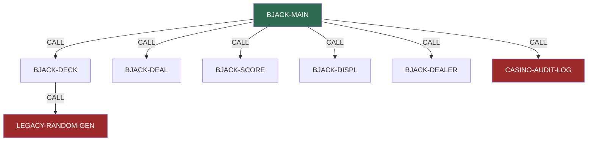
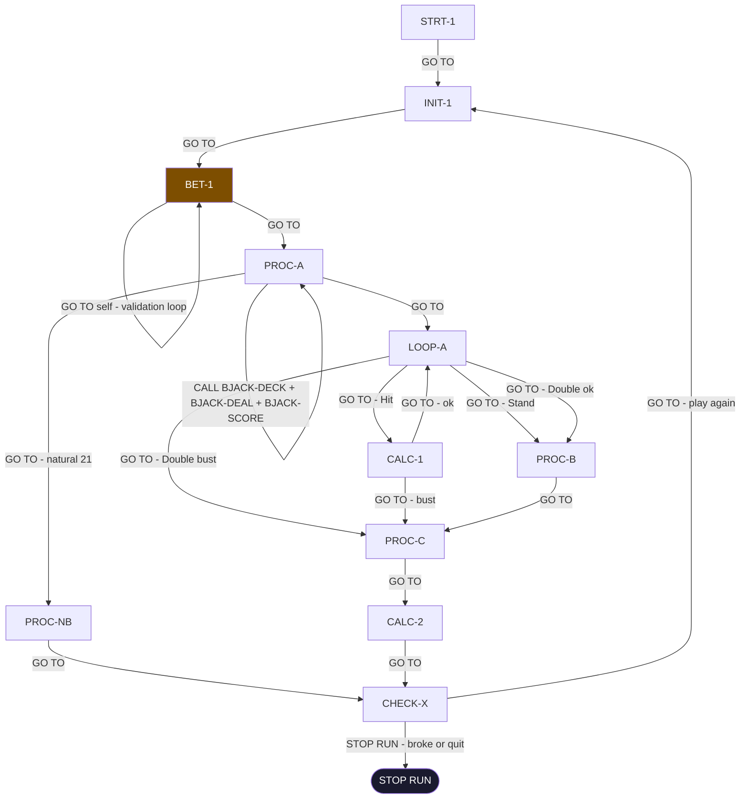

# Po Analysis — BlackJack COBOL Estate
**Generated:** 2026-03-09
**Analyst:** Po (COBOL Analysis Agent)
**Source folder:** `blackjack/source/`
**Modules loaded:** 8 files, 607 lines

---

## Modules

| Program-ID | File | Lines | Role |
|------------|------|-------|------|
| BJACK-MAIN | `bjack-main.cob` | 143 | Main game controller |
| BJACK-DECK | `bjack-deck.cob` | 146 | Card management & shuffle |
| BJACK-DEAL | `bjack-deal.cob` | 68 | Card distribution |
| BJACK-SCORE | `bjack-score.cob` | 88 | Hand evaluation |
| BJACK-DEALER | `bjack-dealer.cob` | 82 | Dealer turn automation |
| BJACK-DISPL | `bjack-displ.cob` | 291 | Terminal display handler |
| LEGACY-RANDOM-GEN | `legacy-random-gen.cob` | 25 | Pseudo-random number generator (broken) |
| CASINO-AUDIT-LOG | `casino-audit-log.cob` | 26 | Audit trail logger (stub) |

---

## Module Dependency Graph

> 🔴 Red = effectively dead/stub modules

---

## BJACK-MAIN Paragraph Call Graph

All internal control flow is via `GO TO` — no structured `PERFORM` calls within BJACK-MAIN.

---

## Key Findings

| # | Finding | Module | Severity |
|---|---------|--------|----------|
| 1 | **Broken shuffle** — `LEGACY-RANDOM-GEN` always returns `7` (fixed value). `PROC-R1` (the real LCG using linear congruential method) was commented out per Defect 0042. Deck is never truly shuffled — every game plays the same card order. | `legacy-random-gen.cob` | 🔴 Critical |
| 2 | **Audit log is a stub** — `CASINO-AUDIT-LOG.PROC-A` just does `GOBACK`. `PROC-WR` (actual file write to audit trail) disabled 1989. Regulatory compliance trail: non-existent. | `casino-audit-log.cob` | 🔴 Critical |
| 3 | **Spaghetti GO TO** — BJACK-MAIN has zero structured PERFORM calls internally. Entire game loop is unstructured GO TO chains. Static analysis of control flow is unreliable. | `bjack-main.cob` | 🟠 High |
| 4 | **Soft-17 logic broken** — `BJACK-DEALER.SOFT-1` checks `WS-CT3 > 0` but `WS-CT3` is reset to `ZERO` in `LOOP-A` just before the scoring recalculation. Dealer never correctly hits on soft 17 despite Nevada Gaming Commission rule change (1989). | `bjack-dealer.cob` | 🟠 High |
| 5 | **Dead commented-out features** — Split hand (3 modules), 5-card Charlie bonus (BJACK-SCORE), Insurance offer (BJACK-DEALER) — all commented out but code still present. Comments reference manager notes and unresolved defects. | Multiple | 🟡 Medium |

---

## Notes on Analysis Method

> This is a **Phase 1 structural analysis** based on static reading of source files.
> No spec layer writes have been made. No analyst approval workflow has been run.
> Full Po pipeline (Analyse Structure → Map Dependencies → Extract Business Rules) will produce structured, queryable output in the spec layer.
