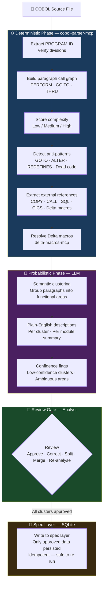

# Mainframe Modernisation with AI Agents — Technical Addendum

---

## Purpose

This document records the findings from an experimental proof-of-concept built to test the core thesis of the whitepaper in practice. The author designed and built the MM Squad — a set of AI agents, MCP servers, and structured workflows for COBOL modernisation — and ran it against a purpose-built COBOL application. This document captures what was built, how it works, what worked well, and what remains to be validated.

---

## Executive Summary

The experimental build validated the central proposition: a structured, human-orchestrated modernisation pipeline can be assembled from GitHub Copilot, GitLab, and the BMAD agentic framework — using tools that are already licensed and operational — without procurement, without new infrastructure, and without a lengthy setup phase.

Seven specialised agents were built and deployed as slash commands in GitHub Copilot. A GitLab MCP server gave every agent native delivery integration — agents posted comments, updated issue status, and generated reports directly in GitLab. A purpose-built COBOL Blackjack application, designed with deliberate bugs and authentic legacy anti-patterns, served as the test corpus.

Key findings: frontier models understand COBOL with solid accuracy and hold their reasoning under deliberate attempts to confuse them. GitLab integration worked without friction. Mid-sprint replanning handled significant scope changes effectively. Group Mode — all agents active simultaneously — proved valuable for problem-solving sessions requiring multiple perspectives at once.

The pipeline is not yet validated against a complex enterprise COBOL estate. That is the next step. What this experiment demonstrates is that the foundation is sound and the approach is viable.

---

## Concept: What We Build On

**BMAD — a mature agentic methodology, extended for mainframe modernisation.**
BMAD is a production-grade agentic framework that extends GitHub Copilot with a structured set of AI agents covering the full software development lifecycle — product management, architecture, development, QA, and delivery. Each agent is a slash command in your IDE with its own menus, workflows, and review gates. We took this mature foundation and adapted the agents for mainframe modernisation — giving each one the right persona, tools, and workflows for COBOL delivery specifically.

**GitHub Copilot Agent Mode — agents and MCP servers with minimal build effort.**
GitHub Copilot's agentic platform lets you define custom agents and connect MCP servers with very low friction. We used this to build the MCP servers that power the analysis pipeline — COBOL parsing, the spec layer, Delta macro resolution, JCL parsing, and GitLab integration — each one a focused capability that any agent in the squad can call.

**GitLab — trackability and project management, built in.**
Every stage of the modernisation pipeline is tracked natively in GitLab. Epics, issues, sprint milestones, review gates, and a live status dashboard — all updated automatically by the agents. No separate project management tool. Approvals happen directly in GitLab, producing the audit trail a regulated environment requires.

**Microsoft–Bankdata — analysis workflow, reverse engineered.**
Microsoft and Bankdata published an open-source COBOL modernisation framework. We reverse engineered the analysis workflow to understand the best practice approach to structural analysis, dependency mapping, and business rule extraction — then built our own implementation on top of the BMAD + GitHub Copilot stack.

---

## The Agent Squad

Seven specialised AI agents, each scoped to a single role in the modernisation pipeline. Every agent is a slash command in GitHub Copilot — invoked directly from the IDE, no separate tooling required.

| Agent | Role | What They Can Do |
|---|---|---|
| **Po** | COBOL Analysis | Parse program structure · build paragraph call graph · score complexity · detect anti-patterns (GOTOs, nested PERFORMs, REDEFINES) · resolve COPY, CICS, DB2, Delta macros · group paragraphs into semantic clusters with plain-English descriptions · map cross-module dependencies · detect subsystem boundaries · recommend migration sequence · extract business rules · write all structured output to the local spec layer · flag every unrecognised construct explicitly |
| **Oogway** | Migration Architect | Read spec layer output from Po · generate target migration architecture · identify subsystem boundaries and shared service candidates · scope architecture to chosen language (Java / Python / COBOL) · check implementation readiness before code generation begins |
| **Shifu** | Delivery Manager | Initialise GitLab project with full label taxonomy · create sprint milestones respecting dependency order · set up issue board mapped to pipeline stages · create and manage a GitLab issue per COBOL module · apply stage labels · transition issues to Awaiting-Review · post structured progress comments · update README dashboard · run sprint planning, sprint status, correct-course, and retrospectives |
| **Tigress** | Java Code Generation | Generate target Java from the spec layer and migration architecture · implement user stories derived from extracted business rules · run code review before handoff to QA |
| **Viper** | COBOL Modernisation | Refactor COBOL in-place — restructuring, dead code removal, anti-pattern remediation · generate modernised COBOL where full migration is not the target · run code review |
| **Monkey** | Python Code Generation | Generate target Python from the spec layer and migration architecture · implement user stories derived from extracted business rules · run code review before handoff to QA |
| **Mantis** | QA Validation | Validate generated code against spec layer business rules · produce coverage report (confirmed / partial / missing) · flag modules requiring rework · formally close GitLab epics with a validation summary when all modules are QA-complete |

Po's analysis runs in two phases: a deterministic static pre-pass using `cobol-parser-mcp` that extracts facts — paragraph call graph, complexity score, anti-patterns, external references, Delta macro calls — followed by an AI phase that proposes semantic clusters and plain-English descriptions. The analyst reviews and approves all AI output before anything is written to the spec layer. Only analyst-approved data is ever persisted. See Appendix A for the full analysis workflow detail.

---

## MCP Servers — The Capability Layer

Five lightweight Python servers run locally on the developer machine. Each agent calls them on demand via the Model Context Protocol — no network, no cloud, no external data transmission. All source code and extracted business rules stay on the local machine at all times.

| MCP Server | Purpose | Tools Exposed |
|---|---|---|
| **cobol-parser-mcp** | COBOL static analysis engine | `parse_module` · `extract_call_graph` · `score_complexity` · `detect_antipatterns` |
| **specdb-mcp** | SQLite spec layer — shared intermediate representation between all agents | `init_schema` · `read_spec` · `write_spec` · `query_spec` |
| **delta-macros-mcp** | Client-specific macro and middleware knowledge base | `get_macro` · `search_macros` · `list_categories` · `add_macro` |
| **jcl-parser-mcp** | JCL job, step, and dataset parsing | `parse_jcl` · `extract_job_graph` · `list_datasets` · `get_job_steps` |
| **gitlab-mcp** | Full GitLab integration for all agents | `create_epic` · `create_issue` · `apply_label` · `create_milestone` · `assign_to_milestone` · `create_board` · `add_comment` · `update_readme` · `close_epic` · `update_issue_status` |

**The spec layer is the message bus between agents.** Po writes structured analysis into the SQLite spec layer — entities, operations, business rules, data flows. Oogway reads from it to design the architecture. Tigress, Viper, and Monkey read from it to generate code. Mantis reads from it to validate. Agents never communicate directly with each other — the spec layer carries the context.

**Each server is independently deployable.** A team can deploy `gitlab-mcp` and Shifu on day one and start managing delivery in GitLab immediately — without waiting for the full analysis pipeline to be built.

---

**Group Mode** — all seven agents active in a single session. Used for production incidents with an unknown root cause, cross-domain design decisions, or unblocking sessions where multiple perspectives are needed at once. Each agent contributes from its own domain. One conversation, one structured output.

---

## The Test Program — COBOL Blackjack

To validate the pipeline end-to-end without touching client code, we built a purpose-made COBOL application: a fully playable Blackjack game written in authentic 1980s mainframe style.

**Why Blackjack?** Real COBOL estates cannot be shared, published, or used as a public demo baseline. Blackjack gives us a real COBOL codebase — multi-module, with copybooks, anti-patterns, and embedded business rules — that anyone can read, run, and verify. The rules of Blackjack are universal, so correctness is easy to confirm: if the migrated game plays correctly, the pipeline worked.

**Why build it rather than use an existing sample?** Existing public COBOL samples are either trivially simple or academically clean. Real legacy systems are neither. We designed this one to be genuinely messy — representative of what the pipeline will actually face in production.

**Source:** [github.com/kamalkantsingh10/cobol-blackjack](https://github.com/kamalkantsingh10/cobol-blackjack)

---

### Structure

| File | Purpose |
|---|---|
| `src/BJACK-MAIN.COB` | Main game loop and control logic |
| `src/BJACK-DECK.COB` | Deck initialisation and shuffle |
| `src/BJACK-DEAL.COB` | Card dealing to player and dealer |
| `src/BJACK-SCORE.COB` | Hand value calculation and Ace adjustment |
| `src/BJACK-DEALER.COB` | Dealer automated turn logic |
| `src/BJACK-DISPL.COB` | Terminal display and rendering |
| `src/LEGACY-RANDOM-GEN.COB` | Random number stub (hardcoded to return 7) |
| `src/CASINO-AUDIT-LOG.COB` | Audit log stub (does nothing) |
| `copy/WS-DECK.cpy` · `WS-GAME.cpy` · `WS-HANDS.cpy` | Shared copybook data structures |

8 source modules, 3 copybooks. Small enough to read in an afternoon. Complex enough to be a real test.

---

### Deliberate Bugs

The codebase contains **9 intentional defects** — each independently verifiable, each representing the kind of embedded business logic error that survives undetected for decades in real legacy systems.

| # | Bug | Where | What it does |
|---|---|---|---|
| 1 | **Biased shuffle** | `BJACK-DECK` | Random generator always returns 7 — every card gets swapped with position 7. The deck is identical every run. |
| 2 | **Dead code paragraph** | `BJACK-DECK` | A "DECK REBALANCE SUBROUTINE" sits after a `GOBACK`. It has never executed. |
| 3 | **Off-by-one in deal array** | `BJACK-DEAL` | A hit card is stored before the count increments — silently overwrites the last dealt card in memory. |
| 4 | **Ace recalculation failure** | `BJACK-SCORE` | Two Aces scores 12 instead of 2 — the adjust loop only reduces the first Ace. |
| 5 | **Soft 17 rule violation** | `BJACK-DEALER` | Dealer does not hit on soft 17. Deviates from standard casino rules. |
| 6 | **No input validation** | `BJACK-MAIN` | Any input that isn't `S` or `D` triggers a hit — garbage input, spaces, empty — all draw a card. |
| 7 | **Payout rounding error** | `BJACK-MAIN` | Natural blackjack pays 3:2 using integer division. A bet of 5 returns 7 instead of 7.5. |
| 8 | **Double-down anytime** | `BJACK-MAIN` | Double-down is offered on every action prompt, not just the initial two-card hand. |
| 9 | **Bet over balance** | `BJACK-MAIN` | Bet validation checks a variable frozen at session start — after losing chips, players can still bet the original balance. |

---

### Deliberate Anti-Patterns

Beyond the bugs, every source file accumulates the structural debt of a real legacy system maintained by multiple teams across multiple decades:

- **Orphaned features** — partially built paragraphs for split hands, five-card Charlie, and insurance — all withdrawn before release, all still compiled into the binary
- **Ghost variables** — working storage fields declared and never read or written anywhere in the procedure division
- **No-op patch statements** — inert statements from emergency patches, with comments warning "DO NOT REMOVE — REQUIRED FOR INITIALIZATION SEQUENCE STABILITY" (they are not)
- **Contradictory version headers** — `WRITTEN` and `UPDATED` dates that conflict across modules, consistent with code copied from other systems without updating the header
- **Foreign-language comments** — six comments in French and German referencing plausible-sounding defect reports and regulatory compliance notes, added by contract teams between 1987 and 1989

---

## Conclusions

**Agents are easily extensible.** Each agent is defined in a small set of markdown files, with workflows structured so only the current step is loaded at any time. Adding new capability means adding files — no code changes, no redeployment. BMAD includes agent-builder and workflow-builder agents that can scaffold new agents from a plain-language description, so AI assists in building the agents themselves. In practice this is fast: adding the ability for Shifu to generate formatted Word documents took under two hours from idea to working slash command.

**Delta macro resolution worked well in the analysis workflow.** Even with a basic macro library, Po was able to resolve macro references during structural analysis, incorporate the macro context into its semantic clustering, and flag any unresolved macros clearly for the analyst to address. The pattern of loading client-specific knowledge through the macro library — rather than embedding it in the model — proved effective in practice.

**Current frontier models are capable COBOL engineers.** We tested Claude Sonnet 4.6 extensively against the BlackJack corpus — asking it to read COBOL it had never seen, identify what was wrong, explain the business logic, and spot the deliberate defects. It performed with solid accuracy across all of these tasks. Attempts to confuse or break the model with ambiguous constructs, orphaned code, and contradictory comments did not succeed. The model held its reasoning. This gives us confidence that the analysis pipeline will perform at the level the business case requires.

**Mid-sprint replanning works.** During the BlackJack modernisation we introduced a significant scope change mid-sprint — adding a complete betting and chip balance system to a game that originally had none. Shifu replanned the remaining sprint around the new scope, restructured the epic breakdown, and produced an updated delivery plan without losing track of what was already done. The agents handled the change the way a good delivery team would: assess the impact, replan, continue. This reflects real engagement conditions where requirements evolve and the plan must move with them.

**Group Mode is effective for problem solving and incident response.** When all agents are active simultaneously, each brings a distinct perspective shaped by their role — Po from the structural and business rule context, Oogway from the architecture, Shifu from the delivery state, the dev agents from the implementation view, Mantis from QA. In a brainstorming session or a production incident, this produces a richer, faster diagnosis than any single agent can provide alone. The conversation naturally converges on a plan of action because each agent is reasoning from a different vantage point over the same problem.

**GitLab connectivity worked flawlessly.** All agents were able to post review comments directly on user stories in GitLab — from their own role's perspective, without any manual copy-paste or context switching. Shifu could connect to the live project, pull the current state, generate sprint reports, and answer questions about delivery status in real time. The integration behaved exactly as designed: GitLab as the single source of truth, with every agent able to read from and write to it as a natural part of their workflow.

**Code analysis holds up in practice.** We tested the model's ability to reason about the MM Squad codebase itself — asking questions with varying levels of context, across long multi-turn conversations. It was consistently able to answer accurately: explaining how a specific workflow step works, identifying where a particular capability lives, tracing how data flows between components. The codebase is not trivially simple, and the model did not lose the thread across extended sessions. For a COBOL estate the same pattern applies — the model can hold enough context to answer meaningful questions about a real system.

---

## Watchouts

**The test application is simple.** BlackJack is a deliberately small, contained codebase. Real COBOL estates are orders of magnitude larger and more complex — with deeply nested batch structures, decades of accumulated patches, and interactions between hundreds of modules. How the pipeline performs on a genuinely complex enterprise application remains to be validated.

**The analysis pipeline needs client-specific inputs to be effective.** Po is not a black-box tool. Before it can analyse a real COBOL estate accurately, it needs to be configured with the client's macro library, business glossary, and naming conventions. Without these inputs, macro references will be unresolved and extracted business rules will lack business-language accuracy. The quality of the output is directly proportional to the quality of the inputs provided during setup.

**Output quality requires a premium model.** When tested with a less capable model, the quality of business rule extraction, semantic clustering, and code generation degraded noticeably. The pipeline is designed around frontier-level reasoning. Running it on a smaller or older model to reduce cost will produce lower-quality outputs. A premium model — Claude Opus 4.6 or equivalent — is a practical requirement, not an optional preference.

**Output quality requires a premium model.** When tested with a less capable model, the quality of business rule extraction, semantic clustering, and code generation degraded noticeably. The pipeline is designed around frontier-level reasoning. Running it on a smaller or older model to reduce cost will produce lower-quality outputs. A premium model — Claude Opus 4.6 or equivalent — is a practical requirement, not an optional preference.

**Token usage is high.** Each agent executes multi-step workflows, considers multiple scenarios at each step, and maintains context across a full session. Group Mode compounds this significantly — running all agents simultaneously in a single conversation is token-intensive. For large COBOL estates processed at volume, token cost is a material budget consideration that should be factored into engagement planning from the outset.

**The analysis agent requires significantly more testing and refinement.** Po was built as an experiment to prove the concept is achievable — and it demonstrates that it is. The workflows and process can serve as a solid starting point. However, before it is used on a real COBOL estate, the analysis workflows need to go through a dedicated refinement stage: tested against more complex programs, validated by experienced COBOL analysts, and calibrated against real macro libraries and dialect variations. The current implementation answers the question of whether it can be done. Making it production-ready is the next stage of work.

---

## Suggested Screenshots

The following screenshots would strengthen this document and any accompanying presentation:

| # | What to capture | Where to find it | Why it matters |
|---|---|---|---|
| 1 | **Agent slash commands in GitHub Copilot** | Type `/bmad-agent-mm` in Copilot chat | Shows the squad deployed as real slash commands — not a mockup |
| 2 | **An agent menu** | Invoke `/bmad-agent-mm-shifu` and show the numbered menu | Makes the human-orchestrated model tangible — the analyst chooses what runs |
| 3 | **GitLab issue board** | The project board with pipeline stage columns and module issues | Shows delivery tracking in action |
| 4 | **GitLab README dashboard** | The auto-generated project README with module status counts | Demonstrates the live status reporting without any manual update |
| 5 | **An agent posting a comment on a GitLab issue** | Any module issue with an agent-generated stage comment | Proves GitLab integration — agents write directly to the delivery platform |
| 6 | **Sprint planning output** | Shifu's sprint plan in GitLab milestones | Shows the full delivery management capability |
| 7 | **BlackJack game running** | Terminal output of `./build.sh` launching the game | Grounds the demo in something concrete and relatable |
| 8 | **Po analysis output** | Po's structural analysis markdown for a BlackJack module — clusters, call graph, complexity score | The centrepiece output — shows what the analysis produces |
| 9 | **Group Mode session** | A multi-agent conversation with several agents responding | Makes Group Mode real for an audience who hasn't seen it |
| 10 | **A workflow step in progress** | Mid-workflow, showing the step file being executed with the review gate prompt | Illustrates how the human stays in control at each step |

---

## Appendix A — Po Analysis Workflow

Po has three independent workflows, each runnable at the analyst's discretion:

| Workflow | Scope | What it produces |
|---|---|---|
| **Analyse Structure** | Single module | Call graph, complexity score, semantic clusters, anti-patterns, external references |
| **Map Dependencies** | Entire estate | Cross-module dependency graph, subsystem boundaries, recommended migration sequence |
| **Extract Business Rules** | Single module | Plain-English business rules, entities, operations, data flows — written to the spec layer |

The recommended order is Analyse Structure (per module) → Map Dependencies (estate-wide) → Extract Business Rules (per module). The analyst decides what to run and when.

### The Two-Phase Pattern

Every Po workflow follows the same fundamental design — a deterministic phase followed by a probabilistic phase, with a human review gate before anything is written to the spec layer.

The deterministic phase establishes facts. The AI phase proposes interpretations. The analyst approves interpretations. The spec layer only ever contains analyst-approved data.

### What Goes Into the Spec Layer

| Layer | Tables | Content |
|---|---|---|
| **Structure** | `cobol_files` · `paragraphs` · `paragraph_calls` · `clusters` · `antipatterns` · `external_references` | Call graph, complexity, semantic groupings, all detected issues |
| **Macros** | `macro_calls` | Every Delta macro reference — resolved or flagged |
| **Dependencies** | `dependencies` · `subsystems` | Cross-module relationships, subsystem groupings, migration order |
| **Business Rules** | `spec_entities` · `spec_operations` · `spec_rules` · `spec_data_flows` | Plain-English business rules, entities, operations, data flows |

All tables are keyed on `program_name` — the COBOL PROGRAM-ID verbatim. All writes are idempotent: re-running any workflow updates existing records without creating duplicates.
