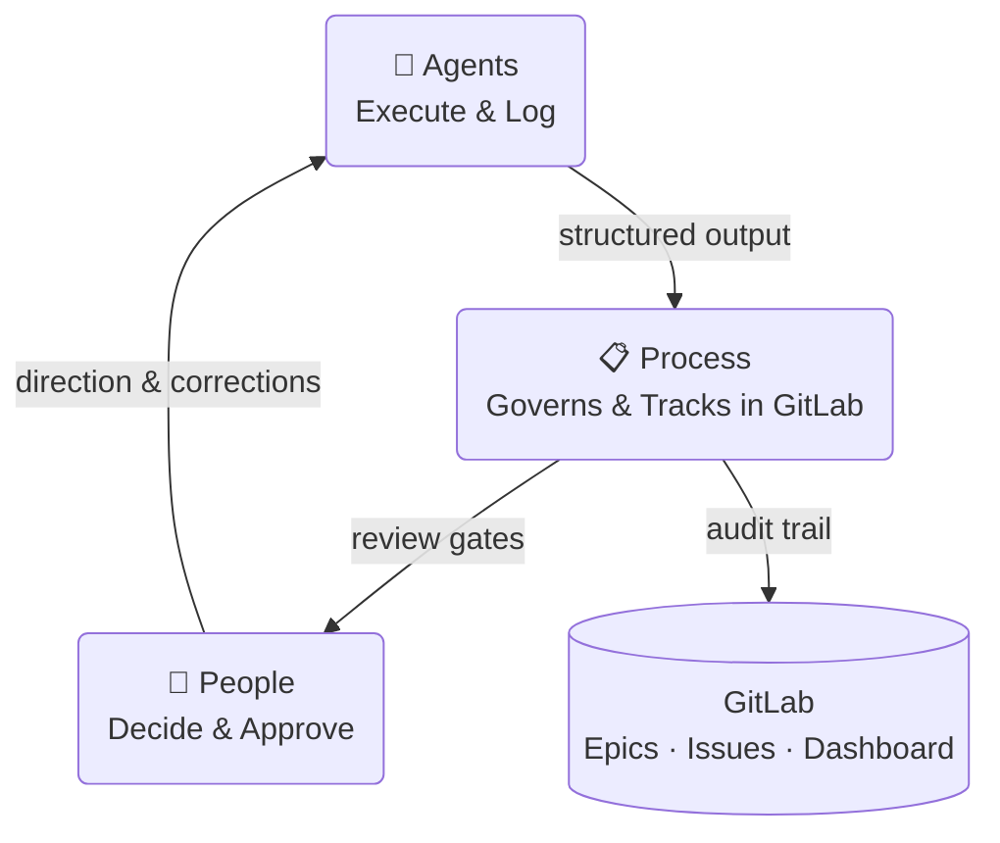
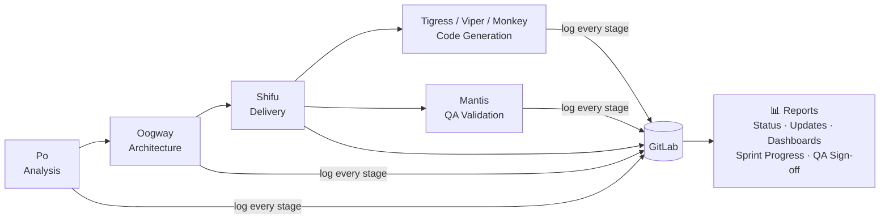
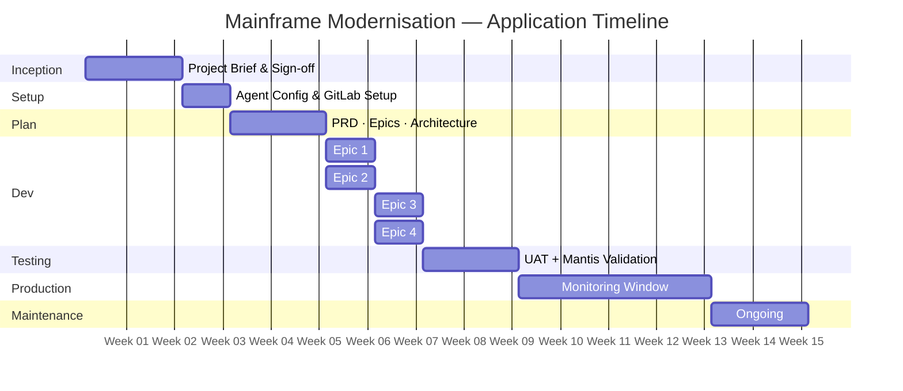
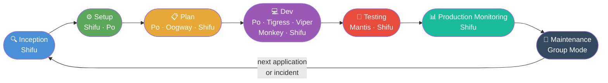
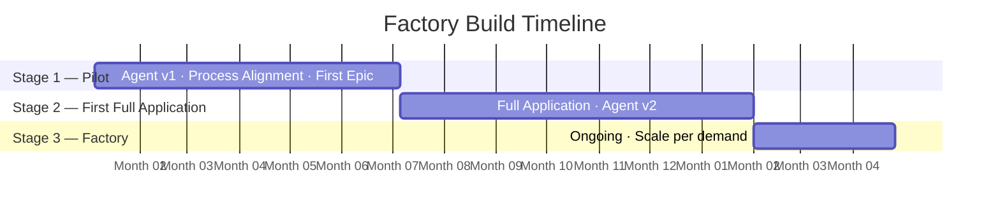
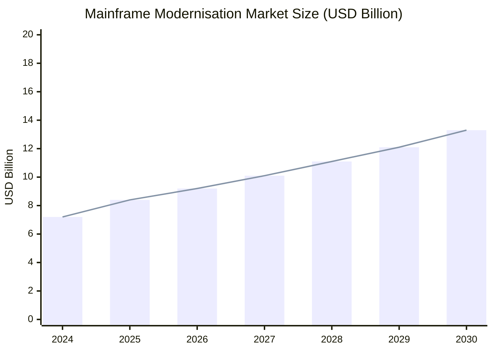
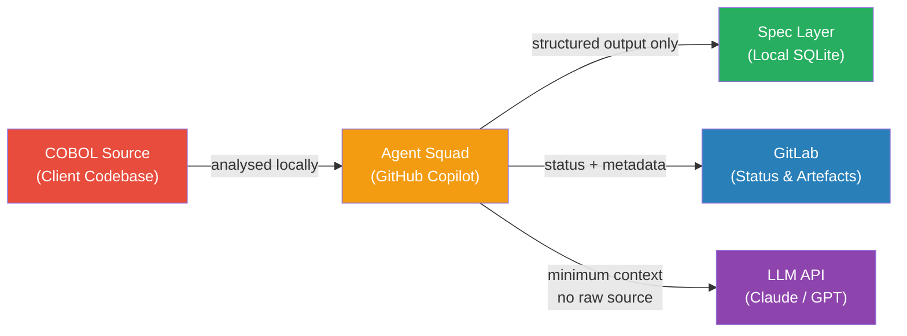
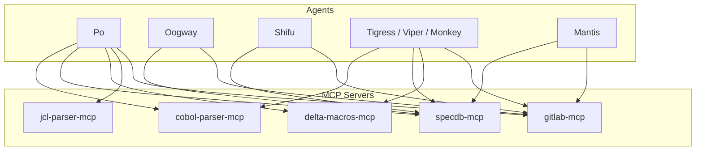

# Mainframe Modernisation with AI Agents — A Practical Approach

---

## 1. Purpose

This document proposes a practical, low-risk approach to COBOL modernisation using AI agents built entirely on tooling already available within the organisation.
It is intended for technology leadership evaluating how to begin — or unblock — a modernisation programme without new software procurement or lengthy setup.

## 2. Executive Summary

COBOL estates represent one of the most persistent and costly challenges in enterprise IT. Legacy systems consume up to 75% of IT budgets in financial services, COBOL expertise is retiring faster than it can be replaced, and the industry's track record with modernisation projects — a 70% failure rate — has made organisations reluctant to commit to another attempt.

Existing AI modernisation tools do not resolve this. They require months of procurement and infrastructure setup before any work begins, they leave end-to-end implementation entirely to the client, and they are built on fixed AI models that cannot access the frontier capabilities available today.

This proposal takes a different approach. The organisation already has everything required to begin: GitHub Copilot, GitLab, and the BMAD agentic methodology. No new software is needed. No procurement cycle is triggered. The proposed solution configures a squad of specialised AI agents on top of these existing tools, applies a structured, human-orchestrated modernisation SDLC fully tracked in GitLab, and produces documentation, business rules, and auditable artefacts as structural outputs of the process — not as a separate workstream.

The engagement is structured in three stages: a six-month pilot to prove the pipeline on one epic, a seven-month full-application delivery to validate the process end to end, and an ongoing factory model scaled by application volume. The pilot requires six headcount from Infosys and minimal time from the bank team, with all approvals handled directly in GitLab.

## 3. The Problem

**Existing tools demand months before a single line of work begins.** The market for AI-assisted COBOL modernisation is active — IBM watsonx Code Assistant for Z, AWS Mainframe Modernisation, Micro Focus, and others all offer products. But every one of them arrives with the same prerequisite: a procurement cycle. In regulated IT departments, vendor approval alone takes [3–12 months](https://swimm.io/blog/cobol-modernization-and-migration-a-guide-for-2025), before any technical setup begins. A [1 million-line COBOL codebase costs $1.5M–$4M and 18–36 months](https://softwaremodernizationservices.com/costs/) using these approaches. Worse, these products deliver tooling, not outcomes — implementation, integration, and day-to-day operation are left entirely to the client team.

**The infrastructure and licensing cost is prohibitive.** Running a dedicated AI modernisation platform means paying for it in full: software licences, server infrastructure, LLM hosting, and the specialised human resource to operate it. [A full modernisation programme runs $2M–$15M+](https://softwaremodernizationservices.com/costs/), with the majority absorbed by setup and tooling before delivery begins. Platforms that run their own hosted LLMs require heavy compute infrastructure — costs that are rarely visible in the initial proposal but consistently dominate the actual spend.

**Locked to yesterday's models.** Most dedicated tools are built around a fixed AI stack. IBM watsonx Code Assistant for Z v2.8 runs on [Mistral and IBM Granite models](https://croz.net/watsonx-final-chapters-before-project-bob/) — models that, while capable for specific tasks, trail the frontier significantly. Claude Opus 4.6 achieves [80.9% on SWE-bench Verified](https://www.anthropic.com/news/claude-opus-4-5) — the leading benchmark for real-world software engineering — outperforming all alternatives on production-grade complexity. Proprietary platforms cannot substitute the underlying model without rebuilding their entire infrastructure. Organisations using them are locked to the model the vendor chose, not the model that performs best.

### What the Organisation Already Has

**GitHub Copilot — the frontier, updated continuously.** GitHub Copilot is the [leading AI coding assistant with 42% market share and 20 million users, powering 90% of Fortune 100 companies](https://www.secondtalent.com/resources/github-copilot-statistics/). Critically, every Copilot Business and Pro subscriber now has [direct access to Claude Opus 4.6 and GPT-5.3-Codex](https://github.blog/changelog/2026-02-26-claude-and-codex-now-available-for-copilot-business-pro-users/) — the same frontier models that IBM's platform cannot reach. These models are refreshed continuously; deprecated models are [replaced within days](https://github.blog/changelog/2026-02-09-gpt-5-3-codex-is-now-generally-available-for-github-copilot/), not years. Every developer already licensed for Copilot has access today, with no additional cost or approval.

**GitHub Copilot Agent Mode — a full agentic framework, already installed.** Copilot has evolved beyond code completion into a [full agentic development environment](https://github.blog/news-insights/company-news/build-an-agent-into-any-app-with-the-github-copilot-sdk/) — one that plans, builds, reviews, and delegates across sessions. Custom agents are defined via simple markdown files; [MCP servers connect without any additional infrastructure](https://docs.github.com/en/copilot/tutorials/enhance-agent-mode-with-mcp). Most developers in the organisation are already using Copilot in some capacity — there is no new tool to learn, no onboarding delay.

**GitLab — purpose-built for AI-assisted delivery.** GitLab is not just a code repository — it is an [end-to-end software lifecycle platform with native AI features](https://about.gitlab.com/) including automated CI/CD, issue generation, test creation, and code review. It maps directly to the traceability and audit requirements of a regulated environment. Every stage of this modernisation process — analysis, architecture, development, QA — tracks natively in GitLab with zero additional tooling.

## 4. Solution — A Mainframe Modernisation Factory

**Built on existing infrastructure, no procurement required.** The proposed solution will run entirely on GitHub Copilot, GitLab, and the BMAD agentic methodology — tooling the organisation already licenses and operates. No new software will need to be procured, no security review initiated, and no additional server infrastructure provisioned. The technical prerequisites are already in place; the work can begin within the current sprint cycle.

**A complete, repeatable modernisation SDLC.** The proposed pipeline will cover every stage of COBOL modernisation: structural analysis, dependency mapping, business rule extraction, migration architecture, code generation, and QA validation. Each stage will be an independently runnable workflow driven by the analyst, with AI executing each step under human supervision and review. All pipeline activity will be tracked in GitLab — epics, issues, milestones, review gates, and a live status dashboard — making delivery auditable at every point and consistent with the organisation's existing agile practices. Once established for one application, the same process will apply to every subsequent application in the estate without modification.

**Access to current frontier models, continuously updated.** Running on GitHub Copilot, the solution will have access to Claude Opus 4.6 and GPT-5.3-Codex — the highest-performing models currently available for software engineering tasks, refreshed on GitHub's continuous release cycle. Beyond the base models, the agents will be configured with the organisation's specific macro library, business glossary, and naming conventions, calibrating the analysis to the actual codebase rather than a generic COBOL corpus.

**Documentation as a structural output of analysis.** Each workflow will produce structured artefacts as a direct output: business rules in plain English, cross-module dependency maps, and a queryable specification layer capturing entities, operations, data flows, and rules. A program that has been analysed will be documented. There is no separate documentation workstream.

**Applicable to maintenance, not just migration.** The analysis workflows will not be scoped exclusively to migration. They will be available to assess the impact of a planned maintenance change, produce onboarding material for a developer new to a program, or verify a program's behaviour before a release. The capability will remain useful and in active use after the initial modernisation work is complete.

**Tool agnostic by design.** The solution is not coupled to any specific AI assistant or model provider. While GitHub Copilot with Claude Opus 4.6 and GPT-5.3-Codex is the proposed starting point given existing organisational licences, the underlying agentic framework is compatible with any coding assistant that supports the Model Context Protocol. If a different assistant or model proves more suitable for a specific workflow or becomes the organisational standard, the solution can adopt it without structural change.

## 5. How It Works

The solution operates across three interdependent pillars. Agents execute the technical work. Process governs sequencing, traceability, and review. People make every material decision and retain full control of outputs before they move downstream.

**Agents — specialised AI for each stage of the pipeline.** The solution will use a set of purpose-built AI agents, each scoped to a specific role in the modernisation pipeline — analysis, architecture, project management, code generation, and QA validation. Each agent will be configured before the first workflow runs, incorporating the organisation's COBOL conventions, business glossary, macro library, and inputs from the existing COBOL developer team. Institutional knowledge that currently lives with individuals will become a formal, reusable input to the system.

**Process — a structured, repeatable SDLC tracked in GitLab.** Each agent operates within a defined workflow with explicit steps, inputs, outputs, and a human review gate before any output moves downstream. Every workflow logs its activity to GitLab: each COBOL program will have a dedicated issue tracking its status from initial analysis through to QA sign-off, with sprint milestones and a live dashboard visible to the full delivery team. The process is identical for every program in the estate — the first engagement establishes the template all subsequent ones follow.

**People — existing roles, no new headcount.** The roles required to operate this process are those already present in the organisation: a COBOL analyst to drive and review analysis workflows, a business domain expert to validate extracted business rules, an architect to review dependency maps and approve the migration design, developers to own and refine generated code, and a delivery lead to manage sprint cycles in GitLab. The agents do not replace these roles — they work under their supervision at every stage.

### 5.1 The Agent Squad

Each agent in the squad has a single, well-defined responsibility. Together they cover the full modernisation pipeline from first analysis to final QA sign-off, with every action logged to GitLab.

**Po — COBOL Analysis Agent.** Po is the entry point for every program in the pipeline and the most critical agent in the squad. It analyses COBOL program structure, builds a call graph of paragraphs, detects complexity and anti-patterns, maps cross-module dependencies, and extracts business rules into a structured specification layer. Po will be configured with the organisation's specific macro library and business glossary before its first run. Because Po's output is a structured, queryable specification layer rather than proprietary format, it can feed into other downstream solutions if required — making it viable as a standalone analysis capability even where the full pipeline is not adopted.

**Oogway — Migration Architect.** Oogway reads the specification layer produced by Po and generates the target migration architecture — identifying subsystem boundaries, service candidates, and the recommended migration sequence based on dependency analysis.

**Shifu — Delivery Manager.** Shifu manages the GitLab project throughout the engagement: initialising epics and issues, running sprint planning, assigning modules to milestones, and maintaining the live status dashboard. Shifu is the operational link between the pipeline and the delivery team.

**Tigress / Viper / Monkey — Code Generation Agents.** Three specialised development agents generate target-language code from the architecture and specification layer — Tigress for Java, Monkey for Python, and Viper for COBOL refactoring. The target language is selected based on the migration architecture defined by Oogway.

**Mantis — QA Validation Agent.** Mantis validates generated code against the business rules held in the specification layer, produces a coverage report, and manages QA sign-off on GitLab epics.

**Group Mode — all agents, one conversation.** The solution supports a group mode in which all agents are active simultaneously in a single session. This is designed for situations that require collective reasoning across the full pipeline — a production incident where the root cause is unknown, a critical design decision that touches analysis, architecture, and delivery at once, or an unblocking session where multiple perspectives are needed quickly. In group mode, each agent contributes from its own domain: Po from the structural and business rule context, Oogway from the architecture, Shifu from the delivery state, and the development and QA agents from the implementation perspective. The output is a shared, structured response rather than a chain of handoffs.

### 5.2 The Process

Each application moves through a defined sequence of stages. At every stage, the relevant agent completes its work, logs the output to GitLab, and sets the issue to *Awaiting Review*. The designated sign-off owner reviews and approves directly in GitLab — no separate tools, no email chains.

**Inception — 2 weeks, signed off by App Owner + Enterprise Architect.** The pipeline begins with a scoping exercise that produces a high-level project brief: target technology stack, epic outline, success criteria, and testing strategy. This brief is the contract for the engagement — nothing proceeds without sign-off from the app owner and architect. The brief is created collaboratively using the agent squad and committed to GitLab as the baseline document.

**Setup & Customisation — 1 week, signed off by Technical Lead.** The agents are configured for the specific application: Po is loaded with the organisation's macro library and business glossary; GitLab is initialised with the label taxonomy, milestone structure, and issue board; and the spec layer database is set up. The technical lead reviews the configuration in GitLab and confirms readiness before the planning stage begins.

**Plan — 2 weeks, signed off by App Owner + Enterprise Architect + Business Domain Expert.** A detailed PRD, full epic breakdown, migration architecture, and testing strategy are produced by the agent squad working with the delivery team. This is the largest sign-off gate in the process — all three stakeholders must approve in GitLab before development begins. This stage produces the audit record that a regulated environment requires before any production system is touched.

**Dev — parallel epics, ~1 week each, signed off by Business Analyst + App Team Tech Lead.** For each epic, Po analyses the relevant COBOL modules, extracts business rules, and divides them into user stories. Development agents implement against those stories. User stories are added and refined during the epic as the COBOL analysis surfaces new rules — the backlog is live, not fixed. Multiple epics run in parallel where dependencies allow, following standard sprint cadence. Each epic closes with a retrospective; any rework identified is added as new stories before the epic is signed off in GitLab.

**Testing — signed off by App Owner + App Team Tech Lead.** Mantis validates each epic's generated code against the business rules in the specification layer and produces a coverage report. This runs alongside human UAT where the application team verifies behaviour against the legacy system. The output of each epic must either match the legacy behaviour exactly or the deviation must be documented and approved as an intentional change per the testing strategy agreed in Inception. Sign-off is recorded in GitLab.

**Production Monitoring — 1 month (or as agreed in Inception), signed off by App Owner.** Following go-live, the application is monitored against the success criteria defined in the Inception brief. The monitoring window is fixed in Inception and formally closed by the app owner in GitLab.

**Maintenance — ongoing, closed by Incident Owner.** When a production incident arises, the relevant agents are invoked — either the full squad in Group Mode for complex or unknown issues, or a targeted subset where the scope is clear. The incident workflow follows the same GitLab-tracked pattern: agents log their analysis and proposed resolution, the incident owner reviews and approves before any change is applied.

### 5.3 People

The process is human-orchestrated at every stage. Agents produce structured output; people review, correct, and approve before anything moves downstream. Accountability for every decision remains with the designated role, not the agent.

| Role | By | Mode | Responsibility | Active Stages |
|---|---|---|---|---|
| **App Owner** | 🏦 Bank | ✅ Approve | Signs off all stage gates; holds final accountability | All |
| **App Team Tech Lead** | 🏦 Bank | ✅ Approve | Reviews and approves dev epics and testing results | Setup, Dev, Testing |
| **Business Domain Expert** | 🏦 Bank | 🤝 Support | Provides business context; validates extracted business rules | Plan, Dev |
| **Delivery Lead** | 🔵 Infosys | ⚙️ Execute | Runs the engagement end-to-end; operates Shifu, manages GitLab sprints and reporting | All |
| **COBOL Analyst** | 🔵 Infosys | ⚙️ Execute | Drives all Po workflows; reviews and corrects analysis output | Setup, Dev |
| **Business Analyst** | 🔵 Infosys | ⚙️ Execute | Produces user stories from extracted business rules; manages epic backlog | Dev |
| **Developers** | 🔵 Infosys | ⚙️ Execute | Review, refine, and own all generated code | Dev |
| **Enterprise Architect** | 🔵 Infosys | ⚙️ Execute + ✅ Approve | Produces the migration architecture; approves technical design before Plan sign-off | Inception, Plan |
| **Project Manager** | 🔵 Infosys | ⚙️ Execute | Owns overall project governance, risk, budget, and stakeholder communication throughout the engagement | All |

**The COBOL expert's role changes, not disappears.** The institutional knowledge held by existing COBOL developers is a direct input to the process — their understanding of macros, naming conventions, and system behaviour is captured during Setup and loaded into agent configuration. From that point, they shift from sole authors to reviewers and validators. The process preserves their knowledge in a structured, reusable form rather than leaving it undocumented when they move on.

**No new skills required, no new headcount.** Every role in this process maps to a position already present in the organisation. Developers are already using GitHub Copilot; GitLab is already the delivery platform; all reviews and approvals happen inside GitLab with no additional tooling. There is no training programme to run and no onboarding delay before the first engagement begins.

For an average application of approximately 700 modules and 500,000 lines of code, the proposed Infosys team is estimated at **3–5 annualised headcount** for the full engagement lifecycle.

## 6. Building the Factory

The full modernisation factory cannot be stood up on day one. It is built incrementally across three stages — each stage delivers working output while establishing the capability for the next.

**Stage 1 — Pilot (6 months, 6 HC).** The first stage establishes the foundation. A team of six — three based in the EU timezone and three in India — will build the first version of the agent squad, align the end-to-end process to the organisation's specific environment, and complete one full epic for a selected application. The output of this stage is a working, configured pipeline validated against real application code and a team that has run the process once end to end.

**Stage 2 — First Full Application (7 months, 6 HC).** The same team takes the full target application through the complete pipeline — all epics, full testing, production monitoring, and handover. The agents are refined based on the experience from Stage 1 into a v2 configuration that reflects the actual patterns, macros, and business rules encountered. By the end of this stage, one application is fully modernised and the factory process is proven end to end.

**Stage 3 — Modernisation Factory (ongoing).** With the process and agents validated across a complete application, the factory operates on a steady-state basis. Team size is determined by the number of applications to be modernised per year. The indicative rate is **2.5 HC per application per annum** — covering analysis, development, QA, and delivery management for each application moving through the pipeline concurrently.

## Appendix

### A — Market Context

The mainframe modernisation market is one of the largest and most durable opportunities in enterprise IT. The data below provides context for the scale of the problem this proposal addresses.

| Statistic | Figure | Source |
|---|---|---|
| Global mainframe modernisation market (2025) | $8.4B | MarketsAndMarkets |
| Projected market size (2030) | $13.3B | MarketsAndMarkets |
| Market CAGR | ~9.7% | MarketsAndMarkets |
| Daily commerce running on COBOL systems | $3 trillion | IBM |
| Average COBOL programmer age | ~60 years | TechTarget / Franklin Skills |
| COBOL programmers retiring by 2030 | ~one-third | Deloitte |
| IT budget consumed by legacy maintenance (financial services) | 70–75% | IBM / AWS |
| Modernisation projects that fail with standard agile | 70% | Industry consensus |
| IBM stock drop on Anthropic COBOL announcement (Feb 2026) | -13% in one day | CNBC / Bloomberg |
| IBM market cap lost in one day | $31 billion | Yahoo Finance |

### B — Competitive Comparison

| Tool | Approach | Procurement | Model | Business Rules | Structured IR | End-to-End Process |
|---|---|---|---|---|---|---|
| **IBM watsonx Code Assistant for Z** | COBOL → Java conversion | Months + licensing | Mistral / Granite (fixed) | ✗ | ✗ | ✗ |
| **AWS Mainframe Modernisation** | Automated refactoring | Months + cloud setup | AWS-hosted (fixed) | ✗ | ✗ | ✗ |
| **Micro Focus / OpenText** | Tooling + services | Months + licensing | Proprietary (fixed) | ✗ | ✗ | ✗ |
| **Microsoft / Bankdata (open source)** | COBOL parsing + analysis | Setup required | Open source (fixed) | ✗ | ✗ | ✗ |
| **This proposal** | Full SDLC on existing tooling | **Zero — start next week** | Claude Opus 4.6 + GPT-5.3-Codex (continuously updated) | ✅ | ✅ | ✅ |

### C — Security & Data Privacy

For a regulated financial institution, the handling of COBOL source code and extracted business rules is a primary concern. The proposed solution is designed as local-first by default.

| Principle | Implementation |
|---|---|
| Source code stays local | All MCP servers run locally via STDIO — no source code is transmitted to external services |
| Spec layer stays local | SQLite database stored on the local machine; path is configurable and gitignored |
| LLM context is scoped | Where LLM API calls are made, context is limited to the specific cluster under analysis — no full program dumps |
| GitLab receives metadata only | Stage labels, status comments, and structured summaries — not raw COBOL source |
| Credentials via environment variables | GitLab token held in `GITLAB_TOKEN` env var — never written to config files or agent definitions |

### D — Agent Capabilities Matrix

Each agent has access to a defined set of MCP server tools. The matrix below shows which servers each agent uses.

| Agent | cobol-parser | specdb | delta-macros | jcl-parser | gitlab |
|---|---|---|---|---|---|
| **Po** | ✅ | ✅ | ✅ | ✅ | ✅ |
| **Oogway** | — | ✅ | — | — | ✅ |
| **Shifu** | — | ✅ | — | — | ✅ |
| **Tigress** | ✅ | ✅ | ✅ | — | ✅ |
| **Viper** | ✅ | ✅ | ✅ | — | ✅ |
| **Monkey** | ✅ | ✅ | ✅ | — | ✅ |
| **Mantis** | — | ✅ | — | — | ✅ |

### E — Glossary

| Term | Definition |
|---|---|
| **COBOL** | Common Business-Oriented Language — a programming language in production use since 1959, predominant in banking, insurance, and government mainframe systems |
| **BMAD** | A structured agentic methodology for software delivery using AI agents and defined workflow steps |
| **MCP** | Model Context Protocol — an open standard that allows AI agents to connect to external tools and data sources |
| **Spec Layer** | A local SQLite database that stores structured representations of COBOL program semantics — entities, operations, business rules, and data flows — serving as the shared intermediate representation between all agents |
| **Agent** | A specialised AI assistant configured with a defined role, a set of tools, and a set of workflows it can execute |
| **Group Mode** | A session in which all agents are active simultaneously, used for cross-domain reasoning such as production incident response |
| **Epic** | A unit of delivery in the modernisation pipeline, covering one logical area of a COBOL application from analysis through to QA sign-off |
| **Review Gate** | A mandatory human approval step in GitLab before agent output progresses to the next pipeline stage |
| **LOC** | Lines of Code — a measure of application size |
| **HC** | Headcount — the number of full-time equivalent staff assigned to an engagement |
